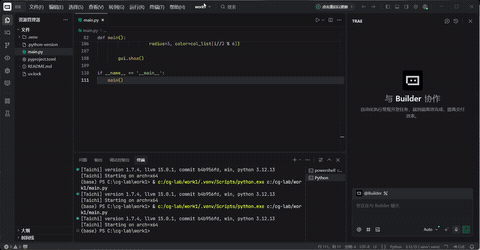

一、实验概述
 
本实验基于Taichi框架，实现3D空间点到2D屏幕坐标的MVP（模型-视图-投影）变换流程，完成线框图形的渲染与动态旋转效果。核心目标是推导并实现模型、视图、透视投影三大变换矩阵，掌握Taichi矩阵操作与并行计算逻辑。
 
二、实验环境
 
- 编程语言：Python 3.x
- 计算框架：Taichi（CPU后端）
- 依赖库：taichi、math
 
三、核心实现要点
 
1. 模型变换矩阵
实现绕Z轴的旋转变换，将输入角度转为弧度后，构建标准Z轴旋转齐次矩阵，完成模型自身的旋转变换。
2. 视图变换矩阵
通过平移变换，将相机位置移至世界坐标系原点，实现相机视角下的场景定位。
3. 透视投影矩阵
按要求分两步实现：
 
- 先将透视平截头体挤压为正交长方体；
- 再通过缩放和平移完成正交投影，将坐标归一化到标准设备坐标系。
实现中正确处理了Z轴符号、视场角与视锥体边界计算。
 
4. 坐标变换流程
严格遵循列向量右乘规则：MVP = M_proj @ M_view @ M_model。
顶点经MVP变换后执行透视除法，再映射到[0,1]的屏幕坐标空间。
5. 效果增强
在基础三角形渲染上，扩展为多顶点3D线框模型；实现自动连续旋转动画，并为不同边设置差异化颜色，提升可视化效果与立体感。
 
四、实验结果
 
程序运行后弹出可视化窗口，展示自动旋转的彩色3D线框模型：
 
- 模型围绕Z轴持续旋转，透视投影效果明显；
- 各边采用不同颜色，轮廓清晰，渲染流畅；
- 完整体现从3D世界坐标到2D屏幕坐标的MVP变换全过程。
 
五、实验总结
 
本实验完整实现了3D渲染中MVP坐标变换的核心流程，验证了模型旋转、视图定位、透视投影的数学原理与代码实现。通过Taichi完成了高效的顶点并行变换，同时以动态彩色渲染直观展示了变换效果，达到了深入理解3D坐标变换、掌握Taichi矩阵与数据编程的实验目标。
